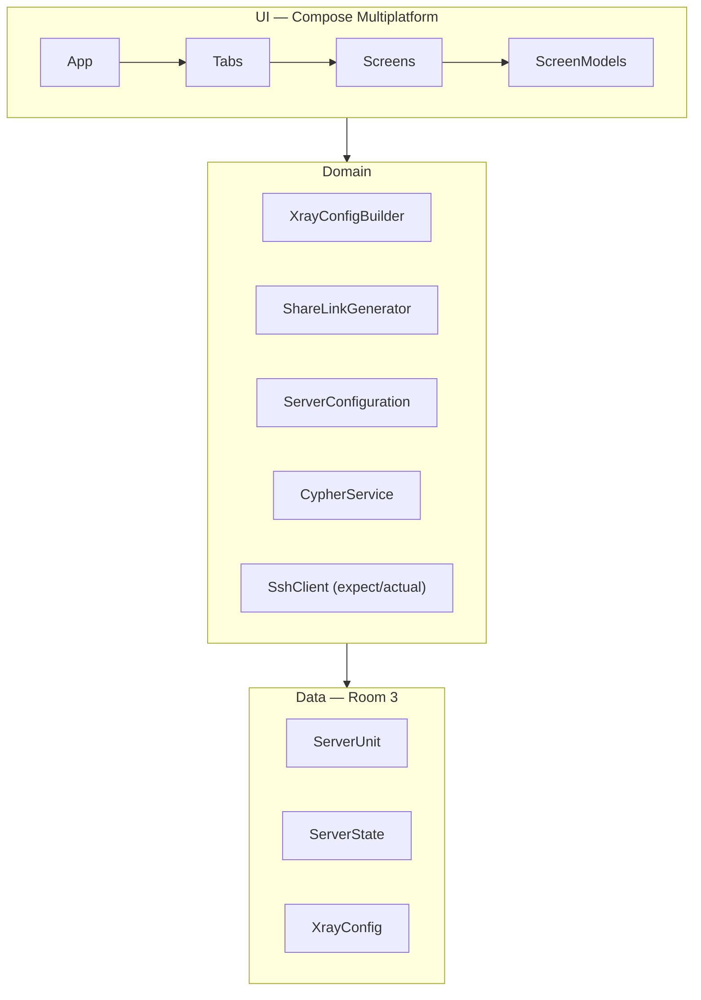
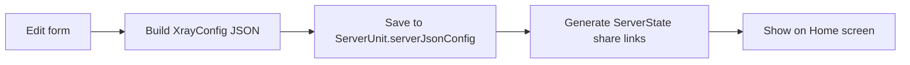

# RayField

**RayField** is a Kotlin Multiplatform app (Android + Desktop) for managing **Xray-core** proxy servers on remote Linux machines over **SSH**. It ships a visual config editor, generates `vless://` / `ss://` share links, and deploys configs via Docker.

| Platform      | Status                  |
|---------------|-------------------------|
| Android       | ✅ minSdk 28             |
| Desktop (JVM) | ✅ macOS, Windows, Linux |

Package: `com.example.rayfield` · Version **1.0.0**

## Features

RayField lets you manage remote Xray servers without hand-editing JSON:

- **Server management** — SSH credentials and metadata stored locally (Room/SQLite)
- **Xray config editor** — VLESS & Shadowsocks inbounds; Reality / TLS / XHTTP stream settings; outbound routing; logging
- **Share links** — auto-generated `vless://` / `ss://` URIs and ready-to-use client JSON per user
- **Remote deployment** — installs Docker + `teddysun/xray` on Debian/Ubuntu hosts via SSH
- **Raw SSH console** — interactive terminal for manual administration
- **Android deep links** — `rayfield://edit?serverId=…&configId=…` opens the editor directly

## Tech Stack

RayField (`com.example.rayfield`) — Compose Multiplatform project:

| Layer         | Libraries                                                                                          |
|---------------|----------------------------------------------------------------------------------------------------|
| UI            | Compose MP, Material 3, [glassmorphism-compose](https://github.com/neilyich/glassmorphism-compose) |
| Navigation    | [Voyager](https://voyager.adriel.cafe/)                                                            |
| DI            | [Koin](https://insert-koin.io/) 4                                                                  |
| Database      | Room 3 + bundled SQLite                                                                            |
| SSH           | [sshj](https://github.com/hierynomus/sshj)                                                         |
| Crypto        | BouncyCastle (X25519 Reality keys)                                                                 |
| Serialization | kotlinx-serialization                                                                              |
| Images        | Coil 3 + Ktor                                                                                      |

Kotlin **2.3.21** · Compose **1.10.3** · AGP **9.1.0**

## Architecture

RayField follows a three-layer structure inside the `composeApp` module:



| Source set                    | Role                                                  |
|-------------------------------|-------------------------------------------------------|
| `composeApp/src/commonMain/`  | Shared UI, domain logic, data models                  |
| `composeApp/src/androidMain/` | `MainActivity`, `RayFieldApp`, platform SSH/crypto    |
| `composeApp/src/jvmMain/`     | Desktop window, custom title bar, platform SSH/crypto |


## Project Structure

All application code lives in the single Gradle module `composeApp`:

```
RayField/
├── composeApp/
│   ├── src/
│   │   ├── commonMain/kotlin/…/rayfield/
│   │   │   ├── data/          # Room entities, Xray JSON models
│   │   │   ├── domain/        # SSH, config builder, share links
│   │   │   ├── di/            # Koin modules
│   │   │   └── ui/            # Screens, navigation, theme
│   │   ├── androidMain/       # Android entry & platform code
│   │   └── jvmMain/           # Desktop entry & platform code
│   ├── schemas/               # Room DB schema (v4)
│   └── build.gradle.kts
├── gradle/libs.versions.toml
├── XRAY.md                    # Annotated Xray-core config reference
└── README.md
```

## User Flows

RayField's main navigation has five bottom-bar tabs (indices 0–4):

| Tab          | Action                                                  |
|--------------|---------------------------------------------------------|
| **Home**     | Grid of saved connections; copy share link, edit server |
| **Edit**     | SSH → Inbound → Outbound → Pro sub-tabs                 |
| **Settings** | Placeholder (not implemented)                           |
| **Raw SSH**  | Pick a server, run commands in a terminal UI            |
| **+ Add**    | Create a new server via the SSH credentials form        |

Empty server list on launch redirects to **Add Server** after 300 ms.

**Saving a configuration** (`EditScreenModel.saveServer()`):



**Remote install** (Pro tab → `ServerConfiguration` over SSH):

1. `apt` install Docker, UFW, curl
2. Write `/etc/xray/config.json`
3. `docker compose up` with `teddysun/xray` (host networking)

## Getting Started

RayField requires **JDK 11+**. Use Android Studio (Ladybug+) for Android; any OS above works for Desktop.

**Android — debug APK**

```shell
./gradlew :composeApp:assembleDebug
```

**Desktop — development run**

```shell
./gradlew :composeApp:run
```

**Desktop — distribution package** (DMG / MSI / Deb)

```shell
./gradlew :composeApp:packageDistributionForCurrentOS
```

**Android deep link:** `rayfield://edit?serverId=<id>&configId=<id>`

## Configuration Reference

RayField edits configs compatible with [Xray-core](https://github.com/XTLS/Xray-core). See [XRAY.md](./XRAY.md) for a fully annotated JSON reference (log, DNS, routing, inbounds, outbounds, transport).

Editor support:

| Category  | Options                              |
|-----------|--------------------------------------|
| Inbound   | VLESS, Shadowsocks                   |
| Security  | None, TLS, REALITY                   |
| Transport | TCP/RAW, XHTTP                       |


## Database
RayField persists data in `rayfield.db` (Android app storage / JVM user home). Schema version **4**, destructive migration on upgrade.

| Entity        | Table           | Contents                                   |
|---------------|-----------------|--------------------------------------------|
| `ServerUnit`  | `server_units`  | SSH credentials + full Xray JSON config    |
| `ServerState` | `server_states` | Per-user share link, client JSON, protocol |

`ServerState` rows cascade-delete when their parent `ServerUnit` is removed.

## Development Notes

Contributing to RayField (`composeApp` module):

- **Hot Reload** — enabled for Compose Desktop via `composeHotReload` plugin
- **Expect/actual** — `SshClient`, `CypherService`, `ClipboardHelper`, `Logger`, theme fonts
- **SSH security** — host key verification disabled (`PromiscuousVerifier`); dev use only
- **Stubs** — QR and Share buttons on Home cards are not yet implemented

## License

Not specified.